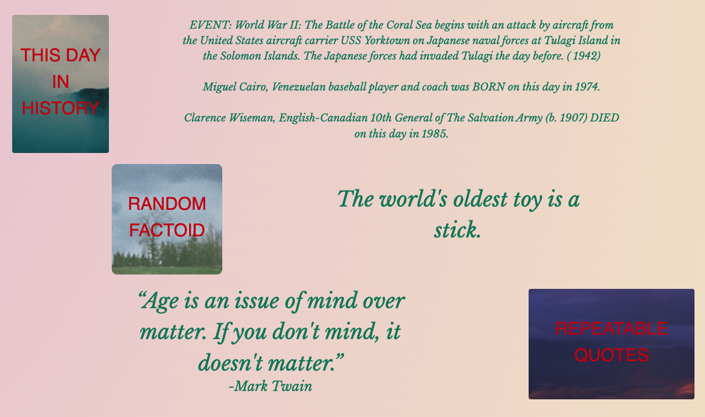

# Conversation Assistant live
> Live demo [_here_](https://3lydaley.github.io/conversationStarter/). <!-- Project link here. -->

## Table of Contents
* [General Info](#general-information)
* [Technologies Used](#technologies-used)
* [Features](#features)
* [Screenshots](#screenshots)
* [Project Status](#project-status)
* [Room for Improvement](#room-for-improvement)
* [Acknowledgements](#acknowledgements)
* [Contact](#contact)

## General Information

Our motivation begins with the harsh solitude of the pandemic and is amplified by the internet days of yore. The latter informs an irreverent, wild wild web of rudimentary yet inexplicably captivating. Websites like stumbleupon, ebaumsWorld, etc. They gave us endless jokes, leading to endless callbacks, (no pun intended) amongst masses of pals. 

Social interaction is tough after two years of (mostly) isolation, and navigating these social moments when they are mediated by augmented reality hasn’t made it much easier. Wouldn’t it be nice to have something solely intended for irl chit-chat? Of course, these tidbits can be applied online, but nothing beats delivering jokes and facts to physically-there people in real time.

## User Story:
- I AM socially awkward from two years of isolation
- I WANT to have interesting jokes, sad stories, and random Kanye West quotes 
- SO THAT I have something to talk to people about at parties
- I WANT to learn all of these things from one webpage and one webpage only
- SO THAT I can have information randomly generated all in one place for ease of access
- I NEED mobile-friendly UI/UX design in case I run out of interesting facts in public

## Technologies Used
- Tech 1 - HTML5
- Tech 2 - CSS
- Tech 3 - Javascript
- Tech 4 - JQuery
- Tech 5 - Bootstrap

## Features
- Dynamic links pulling from various humor API's to display randomly-generated Quotes, facts, jokes, and other quips. Coded to be easily swapped out for new components as well.
- Designed with an Adobe Illustrator designed logo and more laid-back fonts and colors, setting a tone similar to early 00's websites with a modern twist. 

## Screenshots

  
  
  
  

## Project Status
Project is: _in progress_ 

## Room for Improvement
- Improve mobile display by updating layout to columns, arranging elements, and possible implementation of modals for each category.
- Adding a "favorites" feature. Appending a heart icon to each generated query that will save to local storage when clicked and remove from favorites when clicked a second time. 
- Adding a link to view favorited Items
- Update elements to be more animated with UX.
- Add longer and more temporally relevant content to increase user time on the main page. Potentially linking to wikipedia articles, news articles, current goings-on, etc. 

## Acknowledgements
To all the APIs we used in our page!
- [Advice](https://api.adviceslip.com/advice)
- [Fun Facts](https://api.aakhilv.me/fun/facts)
- [Quotes](https://quote-garden.herokuapp.com/api/v3/quotes)
- [This Day in History](https://quote-garden.herokuapp.com/api/v3/quotes)

## Contact
Created by [@3lydaley](https://github.com/3lyDaley) - feel free to contact me!

